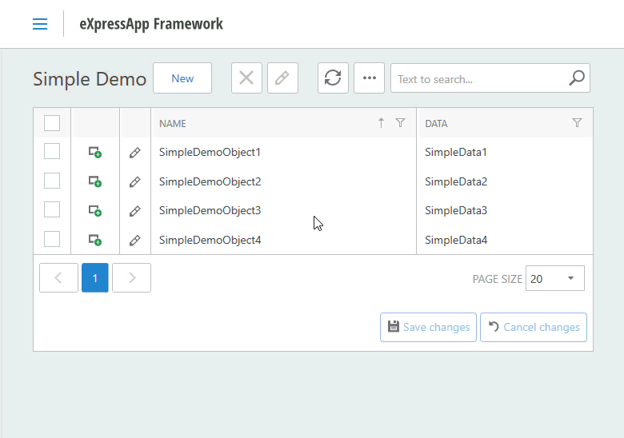

# Reference properties in ASPxGridView's Batch Edit mode - Early Access Preview v19.2

You can display lookup editors for reference properties Batch Edit List Views. If you are using v19.2 or higher, the code-based solution described in <a href="https://docs.devexpress.com/eXpressAppFramework/115835/task-based-help/list-editors/how-to-edit-a-reference-property-in-the-batch-edit-mode">How to: Edit a Reference Property in the Batch Edit Mode</a> is no longer required. Lookup editors are shown automatically.

The demo project from this repository provides the following navigation items.

## Lookup editor for reference properties

This item illustrates a simple lookup.

## ImmediatePostData attribute in Batch Edit mode

This item illustrates how the [ImmediatePostData](https://docs.devexpress.com/eXpressAppFramework/DevExpress.Persistent.Base.ImmediatePostDataAttribute) attribute works in Batch Edit lookups. The ListView's calculated properties (FullName, BooleanPropertyAsString, SquaredNumberProperty) are updated immediately after changing the lookup property.

## Cascade Filtering for Lookup List Views

The item illustrates how to use [Cascade Filtering for Lookup List Views](https://docs.devexpress.com/eXpressAppFramework/112681/Task-Based-Help/Filtering/How-to-Implement-Cascading-Filtering-for-Lookup-List-Views) in Batch Edit mode. The ListView has two lookup properties: Country and City. The City lookup items are populated based on the value selected in the Country lookup.

## Performance on Large Data Sources
This item shows how the lookup editor handles large data sources. The demonstrated lookup has 100,000 rows and [Server mode](https://docs.devexpress.com/eXpressAppFramework/113683/Concepts/UI-Construction/Views/List-View-Data-Access-Modes) is enabled in its model.

